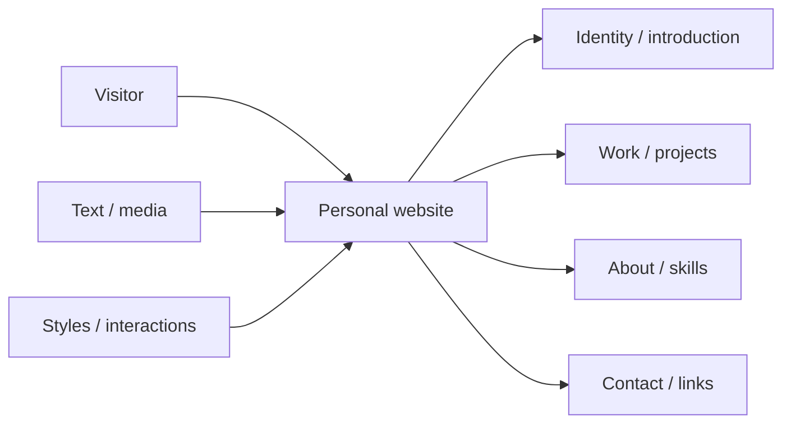
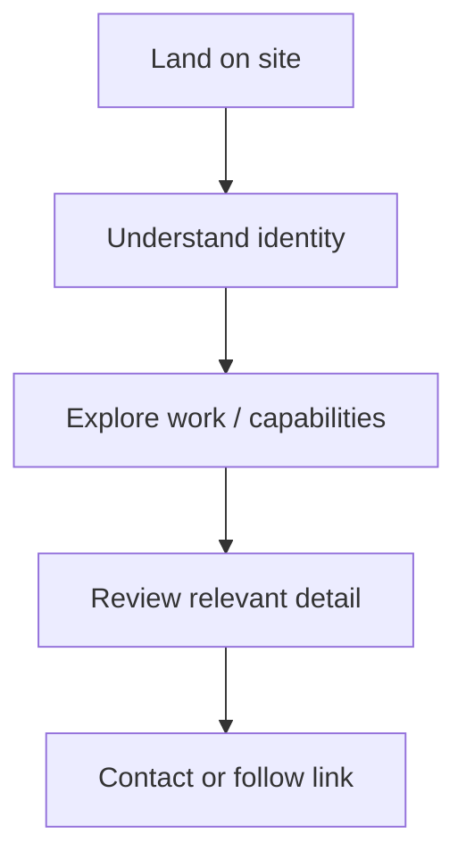
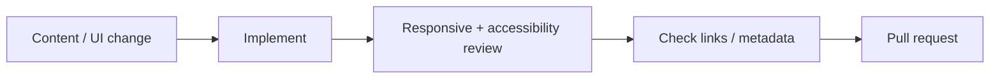

<div align="center">

# Personal Website

**A personal website project for presenting identity, selected work, skills, content, and contact information through a responsive web experience.**


[Browse source](https://github.com/Nischhalsubba/Personal-Website/tree/master) · [Issues](https://github.com/Nischhalsubba/Personal-Website/issues)

</div>

## Overview

**Personal Website** is documented as a public identity and portfolio experience. Visitors should quickly understand who the site represents, what work or capabilities matter, and how to continue exploring or make contact.

<details open>
<summary><strong>🏗️ Interactive website architecture</strong></summary>



</details>

## Visitor flow



## Audience guide

| Audience | Focus |
|---|---|
| Visitors | Identity, work and contact |
| Developers | Structure, behavior, assets and deployment |
| Designers | Hierarchy, responsive behavior, interaction and accessibility |
| Content owners | Accurate work, links, media and metadata |

## Getting started

```bash
git clone https://github.com/Nischhalsubba/Personal-Website.git
cd Personal-Website
```

Use the repository's manifests and lockfiles to determine supported setup commands.

## Design & accessibility

Keep content readable, navigation predictable, focus visible, imagery meaningful, layout responsive, and motion optional. The website should remain understandable even when decorative effects fail to load.

## SEO & discoverability

Use an accurate personal title/description, semantic headings, descriptive project links, meaningful image alternatives, canonical URLs, Open Graph metadata, and structured Person/CreativeWork data where appropriate. Role and skill keywords should match real experience rather than aspirational filler.

## Contribution flow


