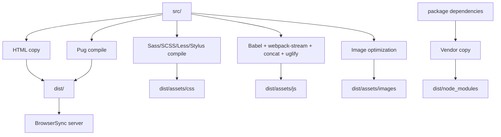
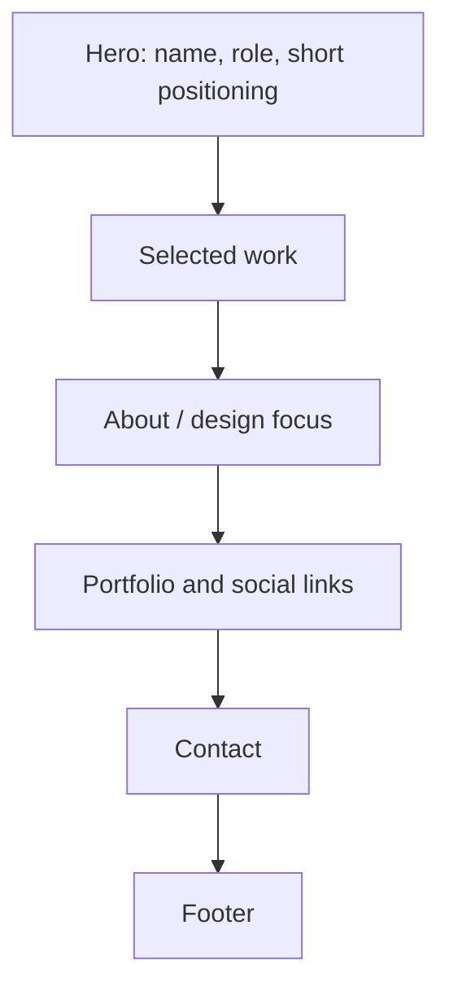

# Personal Website — Product and Engineering Case Study

> A comprehensive product, architecture, build-pipeline, modernization, privacy, accessibility, SEO, and maintenance case study for the `Personal-Website` repository. This document is intentionally detailed so future maintainers, portfolio reviewers, designers, engineers, and AI coding agents can understand what this repo actually is: a legacy Gulp 4 starter-kit scaffold that can become a real personal website, not a finished personal brand site just because the repository name sounds ambitious. Naming things is easy. Building the thing after naming it, tragically, remains required.

## Table of Contents

1. [Executive Summary](#executive-summary)
2. [Repository Snapshot](#repository-snapshot)
3. [Current Reality Check](#current-reality-check)
4. [Product Opportunity](#product-opportunity)
5. [Problem Statement](#problem-statement)
6. [Target Audiences](#target-audiences)
7. [Core Product Promise](#core-product-promise)
8. [Current Technical Architecture](#current-technical-architecture)
9. [Gulp Build Pipeline](#gulp-build-pipeline)
10. [Source and Output Contracts](#source-and-output-contracts)
11. [Task-by-Task System Map](#task-by-task-system-map)
12. [Starter-Kit Debt](#starter-kit-debt)
13. [Personal Website Information Architecture](#personal-website-information-architecture)
14. [Content Strategy](#content-strategy)
15. [Visual Design Direction](#visual-design-direction)
16. [Accessibility Strategy](#accessibility-strategy)
17. [SEO and Social Preview Strategy](#seo-and-social-preview-strategy)
18. [Performance Strategy](#performance-strategy)
19. [Privacy and Contact Strategy](#privacy-and-contact-strategy)
20. [Modernization Strategy](#modernization-strategy)
21. [Migration Options](#migration-options)
22. [Testing and Quality Strategy](#testing-and-quality-strategy)
23. [Deployment Strategy](#deployment-strategy)
24. [Risk Register](#risk-register)
25. [Maintenance Playbook](#maintenance-playbook)
26. [Roadmap](#roadmap)
27. [Portfolio Review Notes](#portfolio-review-notes)
28. [AI Coding Agent Notes](#ai-coding-agent-notes)
29. [Appendix A: Suggested Personal Site Content Contract](#appendix-a-suggested-personal-site-content-contract)
30. [Appendix B: Recommended Source Tree](#appendix-b-recommended-source-tree)
31. [Appendix C: Manual QA Matrix](#appendix-c-manual-qa-matrix)
32. [Appendix D: Suggested AGENTS.md](#appendix-d-suggested-agentsmd)
33. [Appendix E: Glossary](#appendix-e-glossary)
34. [Disclaimer](#disclaimer)

---

## Executive Summary

**Personal-Website** is a public repository named like a personal website, but its current implementation is a legacy Gulp 4 starter-kit scaffold. It includes a sample HTML page, Sass/SCSS/Less/Stylus compilation, Babel/webpack-stream JavaScript processing, image optimization, BrowserSync local server, and a `dist/` build output pipeline.

The repository has value, but not yet as a finished portfolio. Its current value is as a starting point for a static personal website build system.

The product opportunity is to convert the scaffold into a focused personal website for **Nischhal Raj Subba**, likely supporting:

- short professional introduction
- selected product design work
- case study links
- social links
- contact path
- simple SEO metadata
- responsive layout
- accessible page structure
- static deployment

The main technical work is not glamorous. It is replacing starter-kit identity, removing sample content, stabilizing the build stack, and turning the source tree into a real content/product structure. Which is the kind of quiet unsexy work that prevents future chaos, so naturally everyone tries to skip it.

This case study documents the current state, build flow, source/output contracts, risks, modernization options, content strategy, QA expectations, and a practical roadmap for turning this scaffold into a credible personal website.

---

## Repository Snapshot

| Attribute | Value |
|---|---|
| Repository | `Nischhalsubba/Personal-Website` |
| Visibility | Public |
| Default branch | `master` |
| Current app type | Legacy static website scaffold |
| Intended product type | Personal website / portfolio landing page |
| Build tool | Gulp 4 |
| Local server | BrowserSync |
| Template support | HTML and Pug |
| CSS preprocessors | Sass, SCSS, Less, Stylus |
| JavaScript processing | Babel, webpack-stream, concat, uglify |
| Image processing | gulp-imagemin |
| Source folder | `src/` |
| Output folder | `dist/` |
| Main source page | `src/index.html` |
| Main build file | `gulpfile.js` |
| Package metadata status | Updated to identify personal website scaffold |
| Current content status | Still sample starter-kit content |

---

## Current Reality Check

The repository name says **Personal-Website**, but the current source says **Gulp Starter Kit**.

### Current visible source page

`src/index.html` includes:

- title: `Gulp Starter Kit`
- heading: `Gulp Starter Kit`
- description: `A simple Gulp 4 Starter Kit for modern web development.`
- sample image
- stylesheet link to `/assets/css/pages/index.css`
- script link to `/assets/js/all.js`

### Current README state

The README is still mostly inherited starter-kit documentation. It describes:

- Gulp Starter Kit installation
- Sass/SCSS/Less/Stylus support
- Pug support
- BrowserSync server
- image compression
- dependency copying
- npm initializer workflow from the original starter project

### Current package state

The package has been updated to identify this repository as a private/non-publish personal website scaffold rather than an npm starter-kit package.

### Honest conclusion

This repository is not yet a finished personal website. It is a build scaffold with starter content. That is fine, as long as the docs say so. Lying to ourselves through README headings is how repos become haunted storage closets.

---

## Product Opportunity

A personal website for Nischhal can serve as a compact, owned web presence separate from Behance, Dribbble, LinkedIn, GitHub, and individual project repositories.

### Why build it

External platforms are useful but limited:

- Behance shows visual projects but not always product thinking.
- Dribbble favors polished shots over process.
- LinkedIn is noisy and format-constrained.
- GitHub shows technical artifacts but not design narrative.
- A personal domain can connect everything in one place.

### Product goal

Create a lightweight personal website that quickly answers:

1. Who is Nischhal?
2. What does he design?
3. What work should I look at first?
4. How do I contact him?
5. Where can I see deeper portfolio links?

### Better outcome than a generic landing page

The site should not just say “Hello, I am a designer.” That is technically a sentence, but so is “the toaster knows fear.” A good personal site should guide the visitor toward proof.

---

## Problem Statement

### User problem

Recruiters, clients, collaborators, and peers need a fast way to understand Nischhal's professional identity and where to view his work.

### Repository problem

The repository still carries starter-kit identity and sample content, which weakens credibility if deployed publicly.

### Technical problem

The Gulp 4 stack is old and has dependency compatibility risks. It may still work, but modernization or careful version pinning is needed before serious production use.

### Content problem

A personal site needs structured profile content, project highlights, social links, and contact paths. The current page does not contain those.

### Design problem

A personal landing page must communicate quickly, look polished, and remain accessible. A starter-kit sample page does not do that.

---

## Target Audiences

### 1. Recruiters

Need quick role clarity, work links, contact path, and confidence that the site is maintained.

### 2. Potential clients

Need to understand service fit, visual quality, project relevance, and how to reach out.

### 3. Design peers

Need to see craft, taste, and portfolio direction.

### 4. Technical collaborators

Need to know how the static build works and where source files live.

### 5. Future AI coding agents

Need to avoid mistaking starter-kit code for intentional product code.

---

## Core Product Promise

The future personal website should promise:

1. **Clarity**
   - Visitors understand Nischhal's role and direction immediately.

2. **Proof**
   - Selected work links and portfolio examples are easy to access.

3. **Ownership**
   - The site acts as a central web identity outside third-party platforms.

4. **Speed**
   - Static site output loads quickly.

5. **Accessibility**
   - The page is readable, navigable, and mobile-friendly.

6. **Maintainability**
   - Content and build flow are simple to update.

7. **Honesty**
   - The repository should document whether it is a scaffold, work in progress, or production site.

---

## Current Technical Architecture

The project uses a traditional file-based Gulp pipeline.



### Core architectural files

| Path | Purpose |
|---|---|
| `gulpfile.js` | Defines all build, dev, watch, server, and asset tasks |
| `package.json` | Scripts, dependencies, project metadata |
| `src/index.html` | Current sample source page |
| `src/assets/` | Source assets for styles, scripts, and images |
| `dist/` | Generated production/development output |

---

## Gulp Build Pipeline

The build pipeline is defined as:

```js
gulp.task('build', gulp.series('clear', 'html', 'pug', 'sass', 'less', 'stylus', 'js', 'images', 'vendor'));
```

The default task is:

```js
gulp.task('default', gulp.series('build', gulp.parallel('serve', 'watch')));
```

### What this means

When running `npm start`, the project:

1. clears `dist/`
2. copies HTML
3. compiles Pug
4. compiles Sass/SCSS
5. compiles Less
6. compiles Stylus
7. processes JavaScript
8. optimizes images
9. copies dependencies to `dist/node_modules`
10. starts BrowserSync
11. watches files for changes

### Build command

```bash
npm run build
```

### Development command

```bash
npm start
```

or:

```bash
npm run dev
```

---

## Source and Output Contracts

### Source folders

| Source | Path | Purpose |
|---|---|---|
| HTML | `src/**/*.html` | copied to `dist/` |
| Pug | `src/pug/**/!(_)*.pug` | compiled to HTML |
| Sass | `src/assets/sass/**/*.sass` | compiled to CSS |
| SCSS | `src/assets/scss/**/*.scss` | compiled to CSS |
| Less | `src/assets/less/**/!(_)*.less` | compiled to CSS |
| Stylus | `src/assets/stylus/**/!(_)*.styl` | compiled to CSS |
| JavaScript | `src/assets/js/**/*.js` | bundled/transpiled/minified |
| Images | `src/assets/images/**/*` | optimized and copied |
| Dependencies | `node_modules/<dependency>` | copied to `dist/node_modules` |

### Output folders

| Output | Path |
|---|---|
| HTML | `dist/` |
| CSS | `dist/assets/css` |
| JS | `dist/assets/js` |
| Images | `dist/assets/images` |
| Vendor dependencies | `dist/node_modules` |

### Contract rule

Do not edit `dist/` as source. `dist/` is generated output. Edit `src/` instead, unless the deployment strategy explicitly commits generated files.

---

## Task-by-Task System Map

### `clear`

Deletes the `dist/` output folder.

Risk: destructive by design. Safe only because `dist/` should be generated.

### `html`

Copies `.html` files from `src/` to `dist/`.

Use when the site uses plain HTML pages.

### `pug`

Compiles Pug templates from `src/pug/` into HTML.

Use when the site needs reusable layout templates.

### `sass`, `less`, `stylus`

Compiles supported preprocessor files into CSS with sourcemaps, autoprefixing, and minification.

Risk: supporting too many preprocessors can create confusion. A personal website should choose one, probably SCSS or plain CSS.

### `js`

Processes JavaScript through webpack-stream, Babel, concat, and uglify.

Risk: older JS toolchain may not support modern packages cleanly.

### `images`

Optimizes image files.

Risk: old imagemin versions can be brittle on modern Node versions.

### `vendor`

Copies dependencies from `node_modules` into `dist/node_modules`.

Risk: this can bloat output and expose unnecessary files. Modern static sites usually bundle or import only what they need.

### `serve`

Runs BrowserSync on port `3000` using `dist/` as the base directory.

### `watch`

Watches source files and reruns tasks.

---

## Starter-Kit Debt

The repo carries inherited starter-kit debt.

### Examples

- README still describes original Gulp starter kit.
- `src/index.html` still says `Gulp Starter Kit`.
- original package was named `@jr-cologne/create-gulp-starter-kit`.
- original package had npm package `bin` behavior not needed for a personal site.
- dependencies are old.
- Node engine is broad and may hide compatibility issues.
- output copies all dependencies into `dist/node_modules`.

### Why it matters

Starter-kit leftovers make a repository look unfinished. They also make future maintainers unsure what is intentional.

### Rule

Remove or rewrite starter-kit identity before deploying publicly. A personal website should not introduce itself as a build tool. That is like showing up to a job interview wearing the mannequin tag.

---

## Personal Website Information Architecture

A strong personal website can be compact.

### Recommended one-page IA



### Recommended sections

| Section | Purpose |
|---|---|
| Hero | Who Nischhal is and what he does |
| Selected Work | 3 to 5 high-quality project links |
| About | Short professional summary |
| Services / Strengths | UI/UX, design systems, prototypes, dashboards |
| Social Links | Behance, Dribbble, LinkedIn, GitHub |
| Contact | email or contact CTA |
| Footer | copyright, privacy, secondary links |

### Keep it simple

This repository does not need to become a giant SPA unless there is a real reason. The current Gulp workflow is best suited to a static landing page.

---

## Content Strategy

### Hero content

The hero should answer:

- name
- role
- main value proposition
- location/remote availability if useful
- primary CTA

Example direction:

```text
Nischhal Raj Subba
Product Designer focused on clear, scalable product experiences.
```

### Selected work

Include only strong links. A personal website is not a storage shelf for every past experiment.

Good selected-work categories:

- enterprise dashboards
- SaaS/product design
- design systems
- Web3 UX
- portfolio/case-study links

### Contact

Make contact obvious but intentional.

Recommended contact options:

- email
- LinkedIn
- Behance
- Dribbble
- GitHub

### Content rule

Do not invent client names, outcomes, or metrics. A sparse honest portfolio beats a padded suspicious one. Recruiters have seen enough “increased engagement by 400%” folklore to develop antibodies.

---

## Visual Design Direction

A personal landing page should be polished but fast.

### Recommended visual tone

- clean
- modern
- product-focused
- high contrast
- strong typography
- restrained animation
- portfolio-card clarity

### Avoid

- generic starter-kit sample design
- excessive gradients
- tiny text
- decorative animations that delay content
- overly complex build-only visuals
- fake metrics

### Design priority

The page should communicate identity before decoration. Visual style supports the message. It is not a replacement for the message, despite what half the internet seems to believe.

---

## Accessibility Strategy

### Requirements

- semantic HTML
- one clear H1
- descriptive link text
- keyboard-accessible links/buttons
- sufficient contrast
- responsive layout
- meaningful image alt text
- no empty image alt unless decorative
- focus-visible styles

### Current issue

`src/index.html` uses an empty alt attribute on the sample image. That may be fine if decorative, but a real portfolio image should have meaningful alt text or be marked decorative intentionally.

### Accessibility rule

Do not wait until the site is “finished” to care about accessibility. That is like waiting until the house is painted to ask where the doors are.

---

## SEO and Social Preview Strategy

### Minimum SEO requirements

- descriptive `<title>`
- meta description
- canonical URL
- Open Graph title
- Open Graph description
- Open Graph image
- Twitter card
- favicon
- semantic headings

### Current issue

The current source page title is still `Gulp Starter Kit`.

Before deployment, change it to a personal portfolio title such as:

```html
<title>Nischhal Raj Subba — Product Designer</title>
```

### Social preview rule

If the website will be shared in applications, LinkedIn, WhatsApp, or job forms, test previews before calling it finished.

---

## Performance Strategy

The current static build can be fast, but old toolchain choices can cause issues.

### Strengths

- static output
- minified CSS
- minified JS
- image optimization
- local BrowserSync workflow

### Risks

| Risk | Why it matters | Mitigation |
|---|---|---|
| old gulp-sass | Node compatibility issues | modernize to Dart Sass/gulp-sass latest |
| vendor copying | bloated output | remove or replace with bundling |
| imagemin legacy packages | install/build failures | upgrade image pipeline |
| multiple preprocessors | confusing maintenance | choose one CSS workflow |
| no HTML minification | larger output | optional add htmlmin |

---

## Privacy and Contact Strategy

A personal website usually exposes contact information.

### Public-safe contact

- professional email
- LinkedIn
- Behance
- Dribbble
- GitHub

### Be cautious with

- phone number
- home address
- personal WhatsApp
- private client files
- full resume with private details

### Rule

Public contact details should be intentional. The internet is not a quiet room. It is a stadium full of bots with clipboards.

---

## Modernization Strategy

There are two paths.

### Path 1: Keep Gulp and clean the scaffold

Best if the goal is a simple static page.

Actions:

- rewrite README
- replace `src/index.html`
- choose one CSS preprocessor
- remove unused preprocessors
- update package metadata
- add SEO metadata
- add portfolio content
- test build
- deploy static `dist/`

### Path 2: Migrate to modern static tooling

Best if the goal is a real portfolio with reusable components.

Candidate tools:

- Astro
- Vite
- Next.js static export
- plain HTML/CSS with minimal tooling

### Recommendation

For a simple personal landing page, keep it static and clean. For a deeper portfolio with case studies, migrate to Astro or Vite React. Do not keep a complicated old Gulp stack just for nostalgia. Nostalgia does not compile SCSS.

---

## Migration Options

### Option A: Clean Gulp site

Pros:

- minimal conceptual change
- uses existing build pipeline
- quick to ship

Cons:

- old dependencies
- less component-friendly
- possible Node compatibility problems

### Option B: Astro portfolio

Pros:

- excellent static output
- component-based
- good SEO
- content collections possible
- low JavaScript by default

Cons:

- requires migration
- new folder structure

### Option C: Vite React portfolio

Pros:

- interactive capabilities
- familiar React component model
- good for animated portfolio

Cons:

- more JavaScript
- SPA SEO/deployment needs care
- requires fallback routing

### Option D: Plain static HTML/CSS

Pros:

- simplest
- fastest
- easiest to host

Cons:

- harder to maintain if content grows

---

## Testing and Quality Strategy

### Current commands

```bash
npm install
npm start
npm run build
npm run check
```

### Manual QA

- run local server
- confirm BrowserSync loads on port 3000
- confirm `dist/` is generated
- confirm CSS loads
- confirm JS loads
- confirm images load
- check mobile layout
- check title/meta tags
- test links
- test keyboard navigation

### Future automated checks

- HTML validation
- link checking
- Lighthouse audit
- accessibility audit
- image size check
- build smoke test in GitHub Actions

---

## Deployment Strategy

This project outputs static files to `dist/`.

### Static hosting options

- GitHub Pages
- Netlify
- Vercel static deployment
- Cloudflare Pages
- traditional cPanel/static hosting

### Deployment flow

1. Run `npm run build`.
2. Inspect `dist/`.
3. Deploy `dist/` as the static root.
4. Test live page.
5. Test mobile.
6. Test social preview.

### GitHub Pages note

If deploying from GitHub Pages, configure the publish folder correctly or commit generated output if the chosen workflow requires it.

---

## Risk Register

| Risk | Severity | Why it matters | Mitigation |
|---|---:|---|---|
| starter-kit identity remains public | High | weak professional impression | rewrite source and README |
| old dependencies fail install | High | project cannot build | modernize dependencies |
| generated `dist/` edited manually | Medium | changes overwritten | edit `src/` only |
| copied vendor dependencies bloat output | Medium | larger deployment | remove vendor task if unused |
| no SEO metadata | Medium | weak sharing/search | add title/meta/OG tags |
| no accessibility pass | Medium | poor usability | manual a11y checklist |
| phone/private info exposed | Medium | spam/privacy risk | publish only intended contact details |
| no CI build check | Medium | broken deploy risk | add GitHub Actions |
| multiple CSS preprocessors | Low/Medium | maintenance confusion | choose one workflow |
| sample image/content remains | High | unfinished impression | replace all starter content |

---

## Maintenance Playbook

### Replace starter content

1. Edit `src/index.html`.
2. Change title, heading, description, and image.
3. Add real portfolio sections.
4. Update CSS source.
5. Run `npm run build`.
6. Preview `dist/`.

### Add CSS

1. Choose one preprocessor folder.
2. Add styles under `src/assets/scss` or plain chosen path.
3. Avoid using Sass, Less, and Stylus together.
4. Run build.
5. Confirm output CSS path.

### Add JavaScript

1. Add source files under `src/assets/js`.
2. Keep scripts small.
3. Confirm build outputs `dist/assets/js/all.js`.
4. Test browser console.

### Add images

1. Add images under `src/assets/images`.
2. Use descriptive filenames.
3. Add meaningful alt text in HTML.
4. Run build and inspect optimized output.

### Modernize dependencies

1. Create a separate branch.
2. Update one pipeline area at a time.
3. Replace old Sass tooling with Dart Sass if needed.
4. Run build after each change.
5. Do not combine dependency modernization with redesign.

---

## Roadmap

### Near term

- Replace starter-kit homepage content.
- Rewrite README for the actual personal website.
- Add title/meta/OG tags.
- Add real hero section.
- Add selected work links.
- Add contact/social links.
- Add accessibility pass.

### Mid term

- Choose one CSS preprocessor.
- Remove unused preprocessors.
- Add CI build check.
- Modernize Gulp dependencies.
- Add deployment instructions.
- Add screenshots and live URL.

### Long term

- Decide whether to migrate to Astro or Vite React.
- Add reusable components or templates.
- Add case study pages.
- Add blog/notes only if content will be maintained.
- Add privacy page if contact forms or analytics are added.

---

## Portfolio Review Notes

This repository is not currently a strong portfolio artifact by itself because it still contains starter-kit content. However, it can become useful if framed as:

- an early static personal site scaffold
- a legacy Gulp workflow cleanup
- a modernization exercise
- a starting point for a lightweight personal landing page

### Strong honest summary

> Started from a legacy Gulp 4 static website scaffold and began converting it into a personal website foundation, including corrected package metadata, source/output build documentation, modernization planning, and a roadmap for replacing starter-kit content with real portfolio sections.

### What not to claim

Do not claim:

- the repo is already a finished personal website
- the design is complete
- the starter-kit content is intentional brand copy
- the Gulp stack is modern without caveats
- production deployment is configured unless verified

Honesty is not weakness. It is debugging for reputation.

---

## AI Coding Agent Notes

Future AI agents should treat this as a legacy Gulp scaffold unless source files prove otherwise.

### Inspect first

1. `README.md`
2. `package.json`
3. `gulpfile.js`
4. `src/index.html`
5. `src/assets/`
6. `dist/` if committed or used for deployment
7. deployment config, if added later

### Do not

- Do not edit `dist/` as source.
- Do not keep starter-kit content in public deployment.
- Do not assume Node 22 compatibility with old Gulp/Sass packages.
- Do not use all CSS preprocessors at once.
- Do not expose private contact info unintentionally.
- Do not call the repo finished without replacing sample content.

### Prefer

- small source changes
- one preprocessor
- clean metadata
- static HTML first
- accessibility basics
- deployment verification
- dependency modernization in separate commits

---

## Appendix A: Suggested Personal Site Content Contract

```ts
type PersonalSiteContent = {
  name: string;
  role: string;
  headline: string;
  summary: string;
  selectedWork: Array<{
    title: string;
    description: string;
    url: string;
    tags: string[];
  }>;
  socialLinks: Array<{
    label: string;
    url: string;
  }>;
  contact: {
    email?: string;
    linkedin?: string;
  };
};
```

### Minimum content checklist

- [ ] name
- [ ] role
- [ ] one-sentence positioning
- [ ] 3 selected links
- [ ] contact CTA
- [ ] social links
- [ ] SEO title
- [ ] meta description

---

## Appendix B: Recommended Source Tree

```text
src/
  index.html
  assets/
    scss/
      pages/
        index.scss
      components/
      tokens/
    js/
      index.js
    images/
      profile.jpg
      og-image.jpg
```

### Recommended cleanup

If SCSS is chosen:

- remove unused Less examples
- remove unused Stylus examples
- remove unused sample assets
- update README accordingly

---

## Appendix C: Manual QA Matrix

| Area | Test | Expected result |
|---|---|---|
| setup | `npm install` | dependencies install |
| dev | `npm start` | build runs and BrowserSync opens server on port 3000 |
| build | `npm run build` | `dist/` generated |
| HTML | inspect `dist/index.html` | no starter-kit title/copy remains after conversion |
| CSS | inspect page | CSS loads from `assets/css` |
| JS | inspect console | no JavaScript errors |
| images | inspect page | optimized images load |
| responsive | mobile width | layout is readable |
| accessibility | keyboard tab | focus is visible and logical |
| SEO | source head | title, description, OG tags present |
| deployment | live URL | static site loads correctly |

---

## Appendix D: Suggested AGENTS.md

```md
# Repository Instructions

## Setup

This is a legacy Gulp 4 static-site scaffold. Use the Node version supported by the current dependencies. If modern Node fails, test with an older compatible Node version before changing code.

## Commands

- `npm start`: build, serve `dist/`, and watch files with BrowserSync.
- `npm run build`: generate `dist/` once.
- `npm run check`: run the production build.

## Coding conventions

- Edit files in `src/`, not `dist/`.
- Keep generated output out of source edits unless deployment requires committing it.
- Choose one CSS preprocessor instead of mixing Sass, SCSS, Less, and Stylus.
- Replace starter-kit copy before public deployment.

## Testing and verification

Run `npm run build`, inspect `dist/`, and manually test the page in desktop and mobile widths.

## Do not

- Do not publish starter-kit sample content as the final personal website.
- Do not expose private personal/contact information unintentionally.
- Do not modernize dependencies and redesign the site in the same change.
```

---

## Appendix E: Glossary

| Term | Meaning |
|---|---|
| Gulp | JavaScript task runner used to automate file processing |
| BrowserSync | Local development server with reload support |
| Sass/SCSS | CSS preprocessors compiled into CSS |
| Less | CSS preprocessor supported by the scaffold |
| Stylus | CSS preprocessor supported by the scaffold |
| Pug | HTML templating language |
| Babel | JavaScript transpiler |
| webpack-stream | Runs webpack inside a Gulp pipeline |
| dist | Generated output folder |
| source contract | Agreement about where editable files live |
| starter-kit debt | leftover sample code/content from the original scaffold |

---

## Disclaimer

This repository is currently a legacy static-site scaffold and should not be presented as a finished personal website until starter-kit content, metadata, sample images, README language, SEO tags, accessibility basics, and deployment behavior are corrected. Review contact details and portfolio claims before making the site public.
